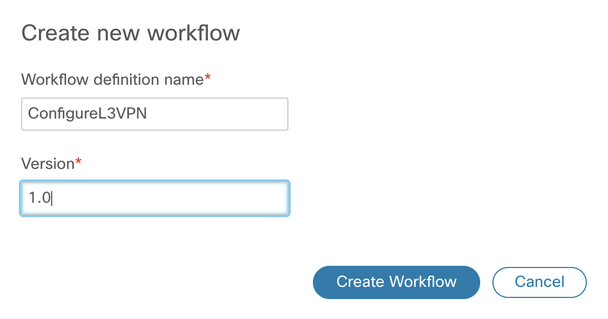
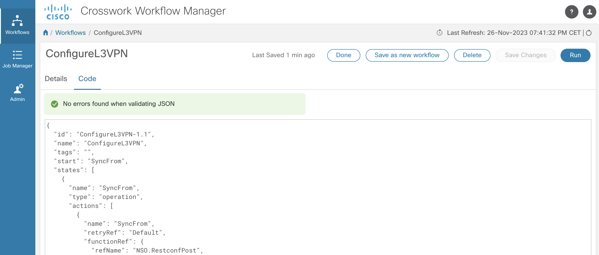
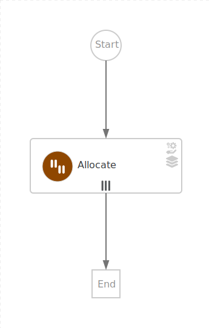
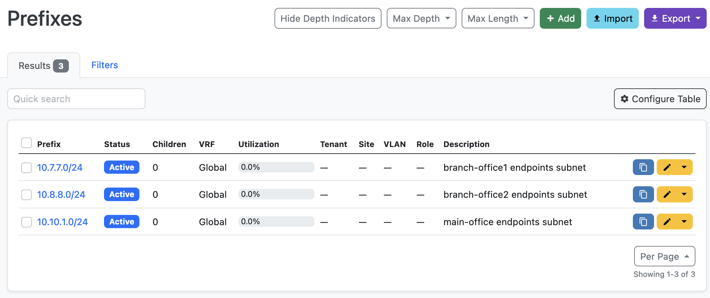
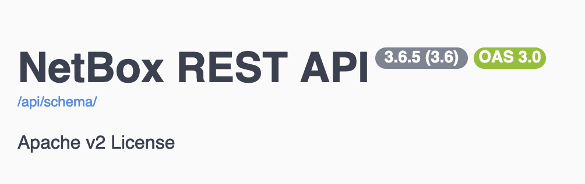

<p align="center">
  <a>
    
  </a>

  <h3 align="center">Connecting the Dots to Automate Workflows</h3>

  <p align="center">
    CWM, NSO, Netbox and Others*
    <br>
  </p>
</p>


## Table of contents

- [Introduction](#introduction)
- [Prerequisites](#prerequisites)
- [Resources](#resources)
- [Part 1](#part-1)
  - [NSO L3VPN Service](#nso-l3vpn-service)
  - [CWM Configuration](#cwm-configuration)
  - [Workflow Definition](#workflow-definition)
- [Part 2](#part-2---adapters-diy)
  - [CWM SDK](#cwm-sdk)
  - [CWM NSO XDK](#nso-xdk)
  - [CWM Open API XDK](#cwm-open-api-xdk)
- [Workflows](#workflows)
- [Resources](#resources)


## Introduction

CWM provides a centralized platform for creating, managing, and executing workflows. 
In this repository you can find examples of workflows towards NSO and Netbox, as well as a guide on how to create your own adapters.

[Part 1](#part-1) - Using pre-built adapters to: 
  - Configure devices with L3VPN service with NSO restconf adapter.
  - Get subnet information for the service from Netbox with generic REST adapter.
  - Post workflow completion notification in Webex space with generic REST adapter.
  - Combine previously written workflows as a subworkflows (child workflows)

[Part 2](#part-2) - Building your own adapters with SDK and XDK and using them in workflows.
  - Simplify workflow creation by building NSO custom adapter to handle service (using SDK, XDK).
  - Generate Adapter for OpenApi Swager tools on example of Netbox IPAM adapter (using SDK, XDK).
  - Workflow using subnet information from Netbox to configure NSO service with newly generated adapters.


## Prerequisites
- **CWM** installed using OVA
  - Generic REST adapter
  - NSO adapter
  - CWM SDK
  - CWM XDK
- **NSO** local install
- **Netbox** instance
- **Webex** account


## Part 1 - Workflows
### NSO L3VPN Service
  NSO example that we use for the purposes of this workflow is setting up a Layer3 VPN in a service provider MPLS network for two NSO-simulated devices. Example is available in NSO:
```examples.ncs/service-provider/mpls-vpn-new-template```

The Layer3 VPN service configures the CE/PE routers for the endpoints
in the VPN with BGP as the CE/PE routing protocol.

#### Start NSO Example

Make sure you start clean and  no old configuration data is present.

```make stop clean all start```

This will setup the environment and start the simulated network.


### CWM Configuration

#### Adapter and Worker

Workflow Adapters are tools that allow a workflow to interact with systems outside the CWM. You can see them as agents between the CWM and any external services (in this example NSO and Netbox). Their role is to cause an action in an outside system that's part of a workflow stream, or to retrieve data required by a workflow to progress. 

Open CWM in browser, in *Admin* tab, go to *Adapters*, upload adapter file by clicking *Add Adapter*.
Check *Create Worker* box to automatically create worker for installed adapter.


#### Resource and Secret
We need to define the resources and secrets to be passed in securely to the Cisco NSO adapter to authenticate to desired applications. In *Admin* tab:


1. Create secret to save authentication credentials towards appplication, you can choose from various secret types.
2. Create resource for the application.


> [!NOTE]
> Please find detailed instructions on how to install adapter and configure resouce and secret: [CWM Documentation](https://www.cisco.com/c/en/us/td/docs/net_mgmt/cisco_workflow/cisco-crosswork-workflow-manager-get-started-guide/m_run-example-workflow-using-cisco-nso-adapter.html)


### Workflow Definition
Workflows are defined using a standardized *Domain Specific Language* based on the [Serverless Workflow specification](https://github.com/serverlessworkflow/specification/blob/main/examples/README.md), enabling workflow designers to express complex business processes, dependencies, and decision logic in a unified and readable format.

#### Workflow 1 - VPN Service Configuration
The purpose of this example workflow is to automatically create a VPN service instance in NSO and configure devices.
We want to translate NSO commands into actions executed in a workflow.
Workflows can be written either in JSON or YAML, all examples available in this repository are JSON files. 


1.  Configure VPN service instance and its route distinguisher. In CLI it would be:
```
vpn l3vpn volvo
route-distinguisher 999
```
In our workflow it looks like this: 

```
"name": "CreateVPN",
"retryRef": "Custom",
"functionRef": {
"refName": "NSO.RestconfPost",
"arguments": {
      "input": {
      "data": "{\"l3vpn\":[{\"name\":\"${ .vpn.name }\",\"route-distinguisher\":\"${ .vpn.rd }\"}]} ",
      "path": "restconf/data/l3vpn:vpn"
      },
      "config": {
      "resourceId": "NSOLocal"
      }}},
```


2. Configure VPN endpoints. We would define 3 of them in CLI:

```
vpn l3vpn volvo
endpoint main-office
ce-device    ce6
ce-interface GigabitEthernet0/11
ip-network   10.10.1.0/24
as-number    65101
bandwidth    12000000
!
endpoint branch-office1
ce-device    ce1
ce-interface GigabitEthernet0/11
ip-network   10.7.7.0/24
as-number    65102
bandwidth    6000000
!
endpoint branch-office2
ce-device    ce4
ce-interface GigabitEthernet0/18
ip-network   10.8.8.0/24
as-number    65103
bandwidth    300000
```

In workflow we will use *foreach* action to execute it 3 times, once for each endpoint

```

"name": "ConfigureEndpoints",
"type": "foreach",
"actions": [
      {
      "name": "ConfigureEndpoint",
      "retryRef": "Custom",
      "functionRef": {
      "refName": "NSO.RestconfPost",
      "arguments": {
            "input": {
            "data": "{\"endpoint\": {\"id\": \"${ .endpoint.name }\",\"ce-device\": \"${ .endpoint.ce }\",\"ce-interface\": \"${ .endpoint.int }\",\"ip-network\": \"${ .endpoint.ip }\",\"bandwidth\": \"${ .endpoint.bw }\"}}",
            "path": "restconf/data/l3vpn:vpn/l3vpn=volvo"
            },
            "config": {
            "resourceId": "NSOLocal"
            }}},
```

Endpoint information, as well as vpn name and RD, comes as an [input](workflows/1/configure_vpn_service.input.json) to the Workflow.


Please find workflow complete JSON file [here](workflows/1/configure_vpn_service.json).


#### Run Workfow
To run Workflow, navigate to Workflows tab in CWM UI


Click *Create New Workflow*.



Once created click on the newly created workflow.


Go to *Code* tab and paste workflow JSON file and save changes



Click Run button, provide [input data JSON](workflows/1/configure_vpn_service.input.json).


Once wokflow execution job is started, you can go to job tab to see the results. 

#### Verify Results

 The results are visible in Cisco NSO. 

 


### Workflow 2 - Allocate Prefix in Netbox

This workflow task is to allocate subnet in Netbox, that later can be used in L3VPN configuration. The comunication with Netbox is going to take advantage of generic REST adapter. It means we have to specify exact path and payload of the resource that we want too use. In this example it will be POST to Netbox /api/ipam/prefixes/ with prefix and description in request body.

Please find workflow complete JSON file [here](workflows/2/allocate_prefixes.json).




Once workflow is completed we can se results in Netbox.




### Workflow 3 - Send Webex Notification

Generic REST API adapter can be used to comunicate with any external service acccessible with REST API. In this example we will write workflow that notifies user on its completion.


Please find workflow complete JSON file [here](workflows/3/webex.json).


### Workflow 4 - Reuse previously written workflows in one workflow executing all the above actions


We can reuse previously created workflows in newly created workflow by calling them inside new workflow definition. Please find workflow complete JSON file [here](workflows/4/netbox_nso_with_child_wfs.json). 


## Part 2 - Adapters DIY

 You may use  pre-built adapters for your workflows, which are available as a part of the CWM offering - NSO adapter and a generic REST API adapter, like we have used in [Part 1](#part-1)). But you can also develop your own custom adapters using Adapter SDK, that may enable or simplify use of external services in workflow definitions. 

### CWM SDK

> [!NOTE]
> To start using the Workflow Adapter SDK, you need to install a Golang environment, Protocol buffers, dedicated go plugins and download the Adapter SDK contained in the CWM software package. Please find mire information in [Adapter Developer Guide](https://www.cisco.com/c/en/us/td/docs/net_mgmt/cisco_workflow/b_adapter-developer-guide/m_adapter_overview.html)


#### Generate NSO custom service adapter with SDK and XDK

In this exampple we will generate custom adapter for L3VPN service. We will use SDK to generate a skeleton of the adapter.

Update the os environment path to include the location of cwm-sdk

```export PATH=/path/to/cwm-sdk:$PATH```


In new empty directory:

```
$ cwm-sdk

Crossworks Workflow Manager SDK v1.0.1
Usage:
    cwm-sdk [options] command [arg...]
The commands are:
    version                  Prints version of application
    create-adapter           Create a new Adapter
    extend-adapter           Generate additional .proto files for a new feature
    update-adapter           Generate code & activity stubs from .proto files
    upgrade-adapter          Update versions and imports for cwm
    create-installable       Build adapter by packaging required source into .tar.gz
    export-proto             Create SDK .proto file
Use 'cwm-sdk command -h' for more information about a command.

$ cwm-sdk create-adapter

Usage:
    cwm-sdk create-adapter [options]
Create a new Adapter.
The Options are:
  -exclude-resource
        Will skip creation of file .resource.proto from template.
  -feature string
        Feature bundling a set of activities. (default <product>)
  -go-module string
        Module name assigned to the go.mod file. (default "cisco.com/cwm/adapters/<vendor>/<adapter-name>")
  -ignore-template
        Will not generate example code in go & proto files.
  -location string
        Location where the new adapter should be created. (default current directory) (default ".")
  -os-architecture string
        architecture where adapter is being developed. Valid options are: 'linux','mac-intel','mac-arm' & 'windows'. (default "linux")
  -product string
        Identifier for the system the adapter is targeting. (required)
  -vendor string
        Identifier for the company creating the system the adapter is targeting. (default "cisco")
  -verbose string
        Will output progress info. Options are: off, on & very (default "off")
```
This shows us the options SDK can help with. In our example we want to create new adapter, for L3VPN service for NSO. 
SDK can generate example code in go & proto files for our adapters. If you want to develop adapter logic yourself, this can give you an idea on how it should be done. In this example, we will use NSO XDK (in next step) to generate adapter's logic automatically from service yang file. We select option *-ignore-template*.
```
$ cwm-sdk create-adapter -feature l3vpn  -ignore-template -product nsox -vendor cisco 
Created new adapter project at location: cisco-nsox
```
Once created we can see the structure for the new adapter:

```
└── cisco-nsox
    ├── Makefile
    ├── adapter.properties
    ├── docs
    │   └── html.tmpl
    ├── go
    │   ├── common
    │   ├── go.mod
    │   └── l3vpn
    └── proto
        ├── cisco.nsox.common.adapter.proto
        └── cisco.nsox.l3vpn.adapter.proto
```


### CWM NSO XDK

Once we have adapter structure ready, next step is to develop logic on what actions adapter exposes.
We can do that by editing go and proto files. Another option is to use XDK to generate this logic automatically, based on service definition in its yang model. 

```
$ cd cisco-nsox 
$ cwm-nsox 

Crossworks Workflow Manager Network Services Orchestrator XDK v1.0.1
Usage:
    cwm-nsox [options] command [arg...]
The commands are:
    version                  Prints version of application
    export-lib               Creates XDK go module
    display-paths            Print all paths in yang file
    display-proto            Prints proto message corresponding to a path in yang file
    display-json             Prints json payload corresponding to a path in yang file
    create-activity          Add new activity to an existing feature
    generate-activity        Add new activity implementation to an existing feature
Use 'cwm-nsox command -h' for more information about a command.
```
We need to locate our yang file and on with XDK *display-paths* we can see all configuration paths this service enables. Below output is shortened, only to the path related to vpn, as it is of our intrest in this example.
```
$ cwm-nsox display-paths -src ~/NSO/examples.ncs/service-provider/mpls-vpn-new-template/packages/l3vpn/src/yang/l3vpn.yang
...
l3vpn:vpn
l3vpn:vpn/l3vpn
l3vpn:vpn/l3vpn=%s
l3vpn:vpn/l3vpn=%s/endpoint
l3vpn:vpn/l3vpn=%s/endpoint=%s
l3vpn:vpn/l3vpn=%s/endpoint=%s/as-number
...
```


```
$ cwm-nsox generate-activity
Usage:
    cwm-nsox generate-activity [options]
Update adapter with new activity generated from yang.
The Options are:
  -activity string
        Name of adapter activity. Default will be based on poi
  -deps string
        Paths to yang imports (comma separated list)
  -feature string
        Adapter feature to be updated (required)
  -poi string
        Path used to generate activity (required)
  -request string
        Reference to request to send: Allowed methods: GET, POST, PUT, PATCH, DELETE & CRUD (default "put")
  -src string
        Path to yang file (required)
  -verbose string
        Will output progress info. Options are: off, on & very (default "off")

```

We generate activity for l3vpn:vpn path and allow all CRUD methods:

```
$ cwm-nsox generate-activity -src ~/NSO/examples.ncs/service-provider/mpls-vpn-new-template/packages/l3vpn/src/yang/l3vpn.yang -poi 3vpn:vpn/l3vpn -feature l3vpn -request CRUD
```

Once activity is generated, we can use SDK once again to generate adapter installable, that we can upload in CWM UI later

```
$ cwm-sdk create-installable
```


```
.
├── Makefile
├── adapter.properties
├── docs
│   └── index.html
├── go
│   ├── common
│   │   └── cisco.nsox.common.adapter.pb.go
│   ├── go.mod
│   ├── go.sum
│   └── l3vpn
│       ├── activities.go
│       ├── adapter.go
│       ├── cisco.nsox.l3vpn.adapter.pb.go
│       └── request.go
├── lib
│   ├── proto
│   │   ├── cwm.xdk.nso.proto
│   │   ├── cwm.xdk.resource.proto
│   │   └── cwm.xdk.secret.proto
│   └── xdk
│       ├── config
│       │   └── config.go
│       ├── errors
│       │   └── errors.go
│       ├── go.mod
│       ├── go.sum
│       ├── logger
│       │   └── logger.go
│       ├── nso
│       │   ├── config.go
│       │   ├── cwm.xdk.nso.pb.go
│       │   ├── json.go
│       │   ├── nso.go
│       │   ├── nsox.go
│       │   ├── request.go
│       │   └── secret.go
│       ├── oas
│       │   └── oas.go
│       ├── pointer
│       │   └── pointer.go
│       ├── resource
│       │   ├── cwm.xdk.resource.pb.go
│       │   └── resource.go
│       ├── rest
│       │   ├── data.go
│       │   └── rest.go
│       └── secret
│           ├── cwm.xdk.secret.pb.go
│           └── secret.go
├── out
│   └── cwm.v1.0.cisco.nsox.v1.0.0.tar.gz
└── proto
    ├── cisco.nsox.common.adapter.proto
    ├── cisco.nsox.l3vpn.adapter.proto
    ├── cwm.xdk.nso.proto
    ├── cwm.xdk.resource.proto
    └── cwm.xdk.secret.proto
```

Adapter project structure after above steps. Installer can be found in **out/cwm.v1.0.cisco.nsox.v1.0.0.tar.gz**.

#### Generate Netbox IPAM adapter with SDK and XDK

We can generate adapter for Netbox in a similar way. In this example we will create an adapter for Netbox IP Addres Management. 

```
$ cwm-sdk create-adapter -ignore-template -vendor netbox -product oasx -feature ipam
$ cd netbox-oasx
```

### CWM Open API XDK

Similarly to NSO asapter, once we have structure generated by SDK, we can develop logic on what actions adapter exposes. With Open API XDK we can generate logic automatically, based on api yaml filethat we can get from Open API application swagger documentation (click on */api/schema/* to download file) 



```
$ netbox-oasx % cwm-oasx
Crossworks Workflow Manager Open Api Specification XDK v1.0.1
Usage:
    cwm-oasx [options] command [arg...]
The commands are:
    version                  Prints version of application
    export-lib               Creates XDK go module
    display-paths            Print all paths in json/yaml file
    display-proto            Prints proto message corresponding to a operation+path
    display-json             Prints json payload corresponding to a operation+path
    create-activity          Add new activity to a feature
    generate-activity        Add new activity implementation to a feature
    generate-feature         Generate new features with activities 
Use 'cwm-oasx command -h' for more information about a command.
```

```
$ cwm-oasx display-paths -src netbox.yaml
...
/api/ipam/ip-addresses/ : [GET POST PUT PATCH DELETE]
/api/ipam/ip-addresses/{id}/ : [GET PUT PATCH DELETE]
/api/ipam/ip-ranges/ : [GET POST PUT PATCH DELETE]
...
```


```
$ cwm-oasx generate-feature
Usage:
    cwm-oasx generate-feature [options]
Update adapter with new feature of activities.
The Options are:
  -feature string
        Adapter feature to be updated (required)
  -path string
        Point of interest in json/yaml file (required)
  -src string
        Path to json/yaml file (required)
  -verbose string
        Will output progress info. Options are: off, on & very (default "off")

$ cwm-oasx generate-feature -src netbox.yaml -feature ipam -path /api/ipam/
```

Once ipam feature code is generated, we can create installable to upload in CWM.

```
$ cwm-sdk create-installable
$ cd out 
$ ls
cwm.v1.0.netbox.oasx.v1.0.0.tar.gz
```

Please find example of [allocate_prefixes](workflows/2/allocate_prefixes.json) workflow definition adjusted to use newly created adapter instead [allocate_prefixes-new-adapter](workflows/5/allocate_prefixes-new-adapter.json).

## Resources


Enjoy :metal:
